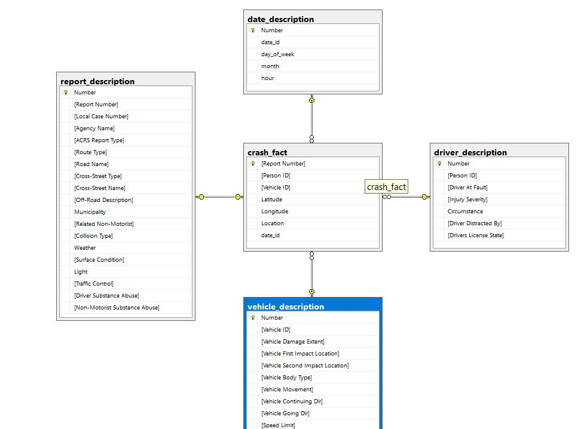
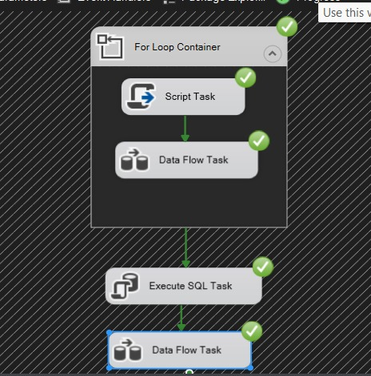

# Project Overview 

## Extraction Process
- We began by downloading the data as a CSV file from Kaggle.
- The data was then split into multiple CSV and TXT files to prepare it for integration into the data warehouse (DW) model.

## Transformation Process
The data transformation process followed the business model guidelines for handling null and unnecessary values.

### Handling Null Values
1. **Imputation:**
   - **Mean/Median Imputation:** Replace null values in numerical columns with the mean or median of the column.
   - **Mode Imputation:** Replace null values in categorical columns with the most frequent value (mode).
   - **Default Values:** Assign default values based on business logic.

2. **Flagging:**
   - Add a new column to indicate whether the original value was null.

3. **Removal:**
   - Consider removing rows or columns with excessive null values, particularly in critical fields.

4. **Forward or Backward Fill:**
   - Propagate non-null values to neighboring null values, especially in time series data.

### Handling Unnecessary Values
1. **Duplicate Removal:**
   - Remove duplicate rows based on unique identifiers.

2. **Outlier Detection and Treatment:**
   - Identify and address outliers using statistical methods.

3. **Data Transformation:**
   - Normalize or standardize numerical values and map categorical values consistently.

4. **Column Filtering:**
   - Remove irrelevant or non-contributing columns.

## Data Warehouse Model
The data warehouse model was meticulously designed to support efficient querying and reporting, structured as follows:

### MySQL Data Warehouse Model
- **Schema:** Designed and implemented with normalized tables to minimize redundancy.
- **Relationships:** Established through primary and foreign keys to ensure data consistency.
- **Indexing:** Applied indexing to enhance performance, particularly in large datasets.

### PostgreSQL Data Warehouse Model
- **Star Schema:** Developed to facilitate quick and efficient analytical queries.
- **Fact and Dimension Tables:** Structured to support complex reporting requirements.
- **Optimizations:** Performance optimizations implemented, including indexing and query optimization techniques.

### SQL Server Data Warehouse Model
- **Integration:** Leveraged SQL Server’s capabilities for integration with SSIS and other Microsoft tools.
- **Data Integrity:** Ensured data integrity through constraints and relationships.
- **Performance:** Optimized loading processes for handling large volumes of data.

## Using SSIS
- SQL Server Integration Services (SSIS) was used to automate the ETL process with workflows and data flows for transforming data and performing queries.

## Analysis
We used the business model to guide our analysis, including:

- **Crash Frequency Analysis:** Frequency of crashes over time.
- **Vehicle Involvement Analysis:** Types of vehicles involved in crashes.
- **Location-Based Crash Analysis:** Identifying crash hotspots.
- **Crash Severity Analysis:** Severity and contributing factors of crashes.
- **Temporal Analysis:** Patterns by time of day, week, and month.
- **Driverless and Parked Vehicle Analysis:** Involvement of driverless and parked vehicles.

### Additional Analyses
- **Weather Condition Analysis:** Impact of weather on crash frequency.
- **Driver Demographics Analysis:** High-risk driver demographics.
- **Road Condition Analysis:** Impact of road conditions on crash frequency.
- **Light Condition Analysis:** Impact of light conditions on crash frequency.
- **Crash Cause Analysis:** Common causes of crashes.
- **Time to Incident Response Analysis:** Emergency response times.
- **Repeat Offender Analysis:** Patterns of repeat offenders.
- **Seatbelt Usage Analysis:** Impact of seatbelt usage on crash severity.

## Adding Constraints and Analytics
1. **Data Integrity:** Implementation of constraints for data integrity.
2. **Analytical Capabilities:** Comprehensive analytics for crash factors.
3. **Reporting:** Reporting solutions for actionable insights.

## Power BI Dashboard
- An interactive dashboard was created using Power BI to visualize and analyze the data, providing insights into vehicle crash accidents.

## Version Control and Docker

- The project was managed using version control (Git) and deployed with Docker Compose. The Docker configuration includes services for MySQL, PostgreSQL, SQL Server, and Jupyter notebooks.
